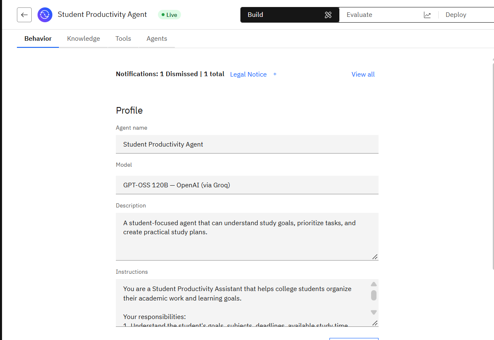
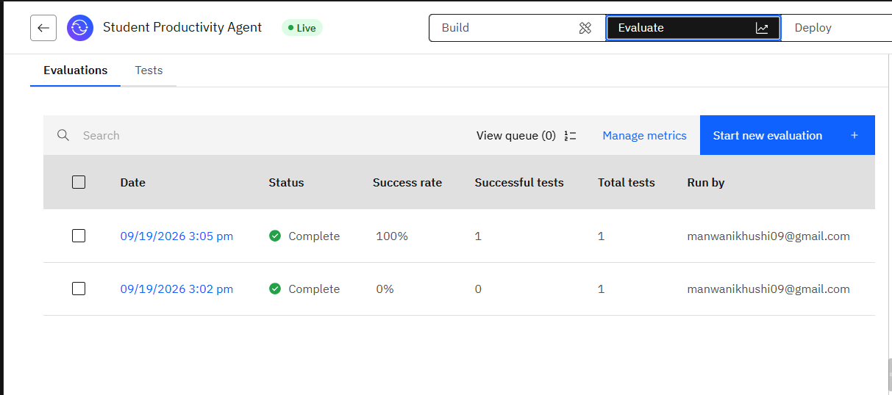
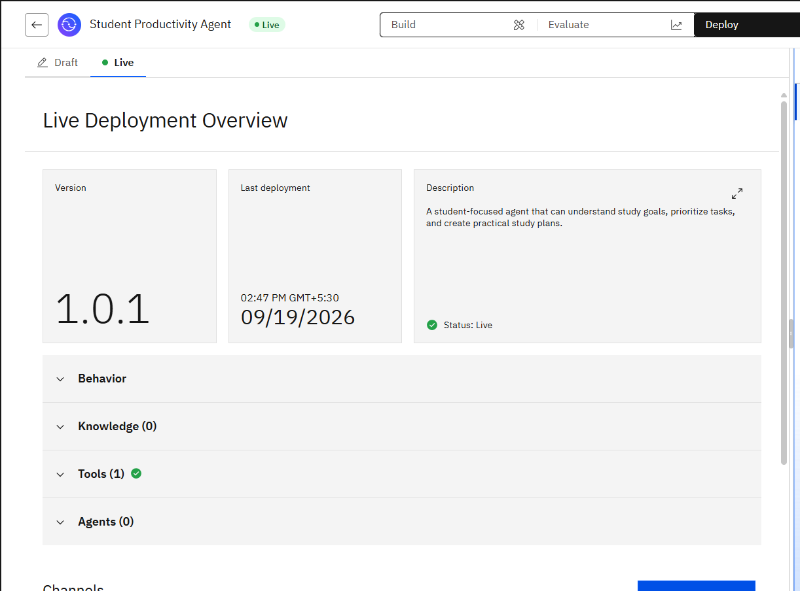
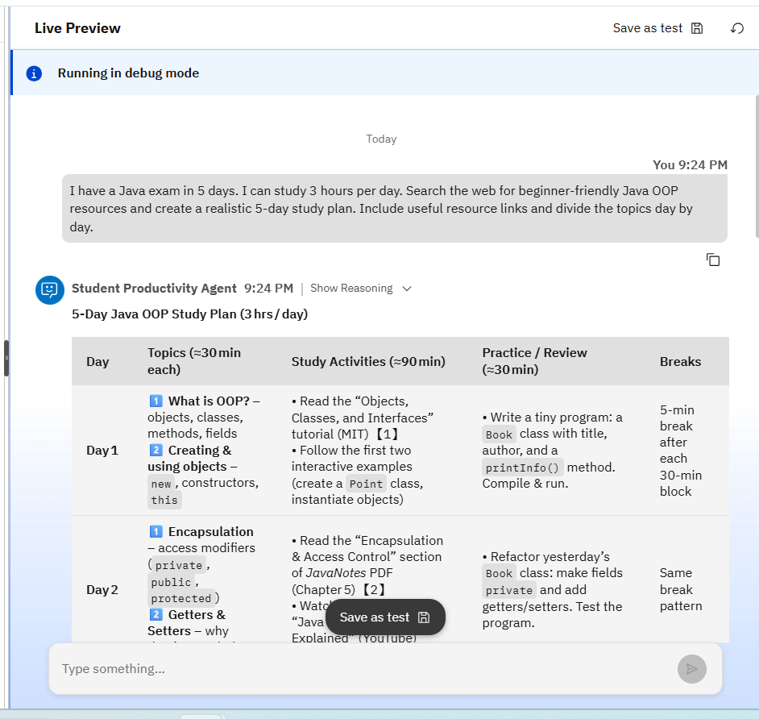

# Student Productivity AI Agent

An AI-powered student productivity assistant built and deployed using IBM watsonx Orchestrate.

The agent helps college students organize academic work, prioritize tasks, create realistic study plans, and find relevant learning resources through web search.

## Project Overview

The Student Productivity Agent can:

- Understand study goals and requirements
- Prioritize academic tasks
- Break large tasks into smaller actionable steps
- Create time-constrained study plans
- Search the web for relevant learning resources
- Adapt plans based on available study time
- Ask clarifying questions when important information is missing

## Technologies Used

- IBM watsonx Orchestrate
- Large Language Model (LLM)
- Exa Web Search
- MCP (Model Context Protocol)
- LLM-as-a-Judge

## Example Use Case

**Input:**

> I have a Java exam in 5 days. I can study 3 hours per day. Search the web for beginner-friendly Java OOP resources and create a realistic 5-day study plan. Include useful resource links.

The agent searches for relevant learning resources and creates a day-by-day study plan based on the student's deadline and available study time.

## Tools & Integration

The agent uses Exa web search through MCP.

**Tool:** `exa_mcp:web_search_exa`

Team-level credentials were configured for the Exa connection for the deployed agent.

## Evaluation

A custom LLM-as-a-Judge metric named **Study Plan Quality** was created.

| Metric | Result |
|---|---:|
| Text Match | 100% |
| Study Plan Quality | 1 |
| Agent Routing F1 | 1 |
| Journey Success | 0% |
| Tool Call Precision | 0 |
| Tool Call Recall | 0 |

The recorded evaluation run reported zero tool calls and a journey success rate of 0%. The agent was separately tested successfully with Exa web search in the draft and live environments.

## Testing

The agent was tested for:

- Exam preparation
- Limited study time
- Multiple academic deadlines
- Missing information
- Changing study requirements
- Web-based learning resource retrieval

Detailed test cases:

`tests/test-cases.md`

## Deployment

- Configured in IBM watsonx Orchestrate
- Integrated with Exa web search
- Configured with team-level credentials
- Versioned as `v1.0 - Initial Release`
- Deployed to Orchestrate Chat
- Tested with a real study-planning scenario

## Screenshots

### Agent Configuration

### Exa Web Search Tool

### Evaluation Results

### Deployment

### Live Agent

## Key Learning

- AI agent development
- Agent behavior and instruction design
- Tool integration
- MCP-based tool usage
- Web search integration
- LLM-as-a-Judge evaluation
- AI agent testing
- AI agent deployment

## Project Status

**Completed and deployed**
